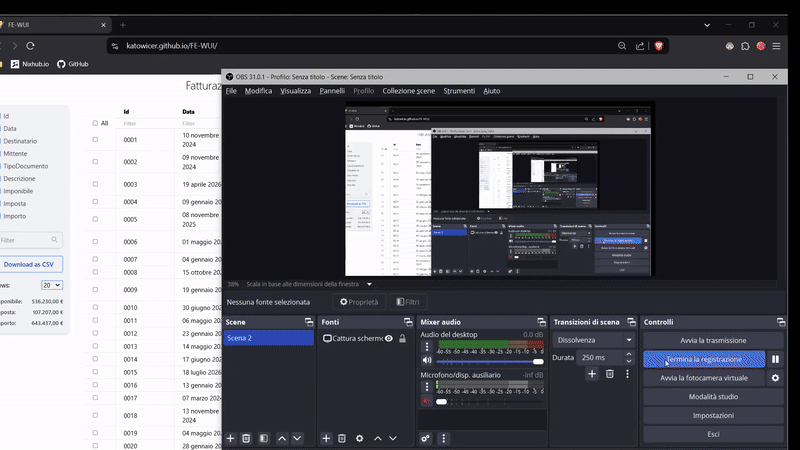

# FE-WUI
Web user interface to manage custom views of Fatture Elettroniche (Agenzia delle Entrate)
<br />
Live demo: https://katowicer.github.io/FE-WUI/

<br />




## Node Dependencies
```sh
fe-wui@0.0.0 /home/hokkaido/devboxes/FE-WUI
├── @sveltejs/vite-plugin-svelte@5.0.3
├── @tailwindcss/vite@4.0.7
├── @tsconfig/svelte@5.0.4
├── @vincjo/datatables@2.5.0
├── svelte-check@4.1.4
├── svelte@5.20.2
├── tailwindcss@4.0.7
├── typescript@5.7.3
└── vite@6.1.1
```

Dependencies: 
- [Vite](https://vite.dev/)
- [Svelte](https://svelte.dev/)
- [Tailwind](https://tailwindcss.com/)
- [Svelte simple datatables](https://vincjo.fr/datatables/)
- [TypeScript](https://www.typescriptlang.org/)

## Accouting Type
The DataTables must be feeded with that the respect the Accouting type specification: see [./src/DataTable.svelte](./src/DataTable.svelte)

## Data 
The provided data must be an array of JSON objects (see examples in [./src/lib/data](./src/lib/data)).

## HTML and XML views
HTML and XML files must be located insed the [XML](./public/XML/) and [HTML](./public/HTML/) folders in Vite's [public directory](./public)

<!-- gen-readme start - generated by https://github.com/jetify-com/devbox/ -->
## Development Environment
[](https://www.jetify.com/devbox/docs/contributor-quickstart/)
This project uses [devbox](https://github.com/jetify-com/devbox) to manage its development environment.

Install devbox:
```sh
curl -fsSL https://get.jetpack.io/devbox | bash
```

Start the devbox shell:
```sh 
devbox shell
```

Run a script in the devbox environment:
```sh
devbox run <script>
```
## Scripts
Scripts are custom commands that can be run using this project's environment. This project has the following scripts:

* [dev](#devbox-run-dev)

## Shell Init Hook
The Shell Init Hook is a script that runs whenever the devbox environment is instantiated. It runs 
on `devbox shell` and on `devbox run`.
```sh
test -z $DEVBOX_COREPACK_ENABLED || corepack enable --install-directory "/home/hokkaido/devboxes/FE-WUI/.devbox/virtenv/nodejs/corepack-bin/"
test -z $DEVBOX_COREPACK_ENABLED || export PATH="/home/hokkaido/devboxes/FE-WUI/.devbox/virtenv/nodejs/corepack-bin/:$PATH"
echo 'Welcome to devbox!' > /dev/null
```

## Packages

* [nodejs@23.7.0](https://www.nixhub.io/packages/nodejs)

## Script Details

### devbox run dev
```sh
npm run dev
```
&ensp;

<!-- gen-readme end -->

## Docker
Spin a docker container via the provided [Dockerfile](./Dockerfile). 
<br />
A [devcontainer environment](./.devcontainer)in also provided.

## .env
Enalbe [Direnv](https://direnv.net/) integration using the [](./.envrc) provieded
